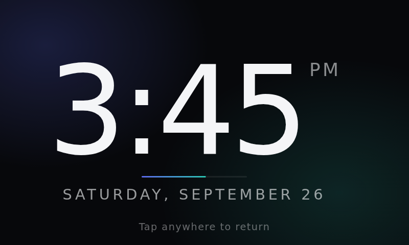

# Home Assistant touchscreen kiosk for Raspberry Pi

Turns a Raspberry Pi 3 with a 5" touchscreen into a Home Assistant wall panel:

- **Boots straight into Home Assistant** (`http://homeassistant.local:8123`),
  full screen, with no desktop, cursor or browser bars.
- **Stays logged in.** It never asks for a password after the first setup.
- **Idle clock.** After 2 minutes with no touches (you can change this), a
  full-screen clock fades in. Tap anywhere to go back to the dashboard. That
  tap only dismisses the clock, so it won't also switch on a light by accident.
- **Recovers by itself.** If Chromium crashes or the power drops, it comes back
  on its own. After a reboot it waits for Home Assistant to be reachable.



## What you need

- Raspberry Pi 3 (a 4 or 5 works too) with a 5" touchscreen (800×480 HDMI+USB
  or DSI).
- **Raspberry Pi OS Lite**. Use Raspberry Pi Imager, and in its settings set a
  username and password, your Wi-Fi, and **enable SSH**.
- A Home Assistant user for the panel. Create a separate non-admin user, for
  example `kiosk`, under *Settings → People → Add person → Allow login*.

## 1. Install on the Pi

SSH in (`ssh <your-user>@<pi-hostname>.local`) and run:

```bash
sudo apt-get update && sudo apt-get install -y git
git clone https://github.com/Davette10/Davette10.git ha-kiosk
cd ha-kiosk
sudo ./install.sh
```

The installer asks five questions. Press Enter to accept a default:

| Setting | Default | Notes |
|---|---|---|
| Home Assistant URL | `http://homeassistant.local:8123` | Use the IP address instead if `.local` doesn't resolve on your network |
| Clock after (seconds) | `120` | |
| 24-hour clock | `no` | |
| Show seconds | `no` | |
| Page zoom | `1` | Try `0.8` to fit more of the dashboard on a 5" screen |

The answers are saved in `/etc/ha-kiosk.conf`. To change them later, edit that
file and run `sudo systemctl restart getty@tty1`.

## 2. Auto-login

Choose **one** of these two options.

### Option A (recommended): trusted network, no password at all

Home Assistant logs in any request from the Pi's IP address automatically, as
the kiosk user. There is nothing to type and nothing that can expire.

1. In your router, give the Pi a **fixed IP** (DHCP reservation).
2. In Home Assistant, find the kiosk user's ID: *Settings → People → Users*
   tab, then click the user. (If the Users tab is missing, turn on *Advanced
   mode* in your profile.)
3. Add the block from [`homeassistant/trusted_networks.yaml`](homeassistant/trusted_networks.yaml)
   to `configuration.yaml`, with your Pi's IP and the user ID filled in.
4. Go to *Developer tools → Check configuration*, then restart Home Assistant.

> Anything on that IP gets logged in as the kiosk user. Give that user only the
> access the panel needs, and don't make it an admin.

### Option B: log in once and let it remember you

The kiosk's browser profile is kept across reboots, so Home Assistant's
**"Keep me logged in"** works just like it does on a phone:

1. Plug a USB keyboard into the Pi for the first boot.
2. Log in as the kiosk user and tick **Keep me logged in**.
3. Unplug the keyboard. It won't ask again unless you log the panel out or
   revoke its token in Home Assistant (*Profile → Security*).

## 3. Reboot

```bash
sudo reboot
```

The Pi boots, logs in on the console, and opens Home Assistant in full screen.

## Tips for a 5" screen

- In Home Assistant, open the kiosk user's profile and turn on **Always hide
  the sidebar** to free up space.
- Make a dashboard just for the panel with big buttons, and set it as the
  kiosk user's default dashboard (*Profile → Dashboard*).
- If everything looks too big, set `ZOOM="0.8"` in `/etc/ha-kiosk.conf`.

## Managing it

| Task | Command (over SSH) |
|---|---|
| Restart the kiosk | `sudo systemctl restart getty@tty1` |
| View the log | `cat ~/.ha-kiosk.log` |
| Clear the saved login / reset the browser | `rm -rf ~/.config/ha-kiosk-chromium` then restart the kiosk |
| Update after `git pull` | `sudo ./install.sh` (keeps your settings) |
| Remove everything | `sudo ./uninstall.sh && sudo reboot` |

SSH sessions are unaffected. The kiosk only starts on the Pi's own screen.

## Troubleshooting

- **The touchscreen is upside down or rotated.** Rotate it at the boot level so
  the touch input rotates too. On current Raspberry Pi OS, add
  `video=HDMI-A-1:800x480M@60,rotate=180` (or `DSI-1:…`) to the end of the
  single line in `/boot/firmware/cmdline.txt`.
- **"This site can't be reached".** Check that the Pi can resolve Home
  Assistant with `curl -I http://homeassistant.local:8123`. If it can't, put the
  IP address in `HA_URL`.
- **You still get the login screen with Option A.** The Pi's IP in
  `configuration.yaml` must match what Home Assistant actually sees. If Home
  Assistant is behind a reverse proxy, the kiosk has to connect directly, not
  through the proxy.
- **It's slow.** A Pi 3 has 1 GB of RAM. Keep the kiosk dashboard simple:
  avoid camera streams, many history graphs and heavy custom cards.

## Desk enclosure

[`enclosure/`](enclosure) has a 3D-printable, Echo Show–style desk stand for
the Elecrow 5" display with the Pi mounted behind it. All cables come out one
notch in the back.

## How it works

```
power on
  └─ systemd auto-logs in the user on tty1       (getty@tty1 override)
      └─ ~/.bash_profile runs startx             (tty1 only, not over SSH)
          └─ kiosk/xinitrc: screen blanking off, tiny window manager
              └─ kiosk/run-chromium.sh: wait for HA, launch Chromium --kiosk,
                 relaunch if it exits
                  └─ clock-extension/: content script that draws the idle clock
```

| Path | Purpose |
|---|---|
| `install.sh` / `uninstall.sh` | Set up / remove everything on the Pi |
| `kiosk/xinitrc` | The X session |
| `kiosk/run-chromium.sh` | Chromium launcher and restart loop |
| `clock-extension/` | Chromium extension with the idle clock |
| `homeassistant/trusted_networks.yaml` | Home Assistant auto-login config |
