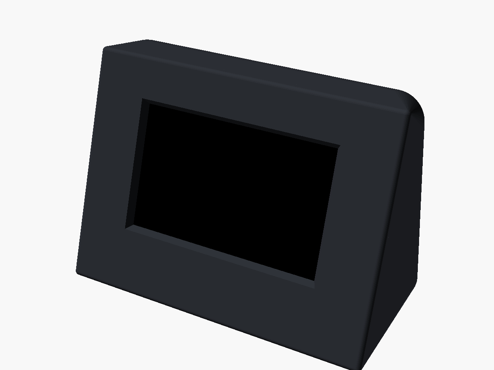
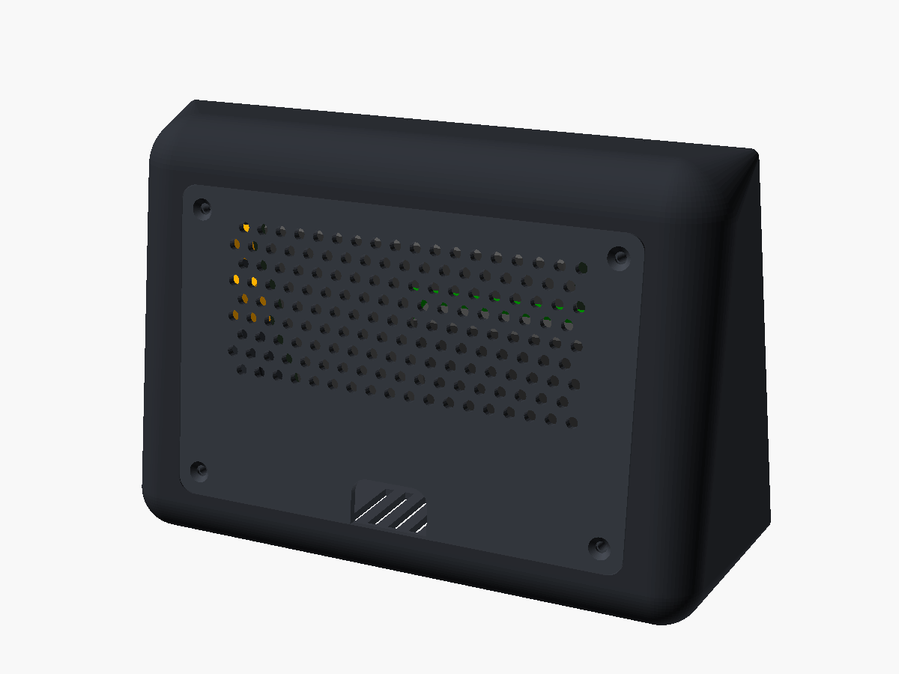
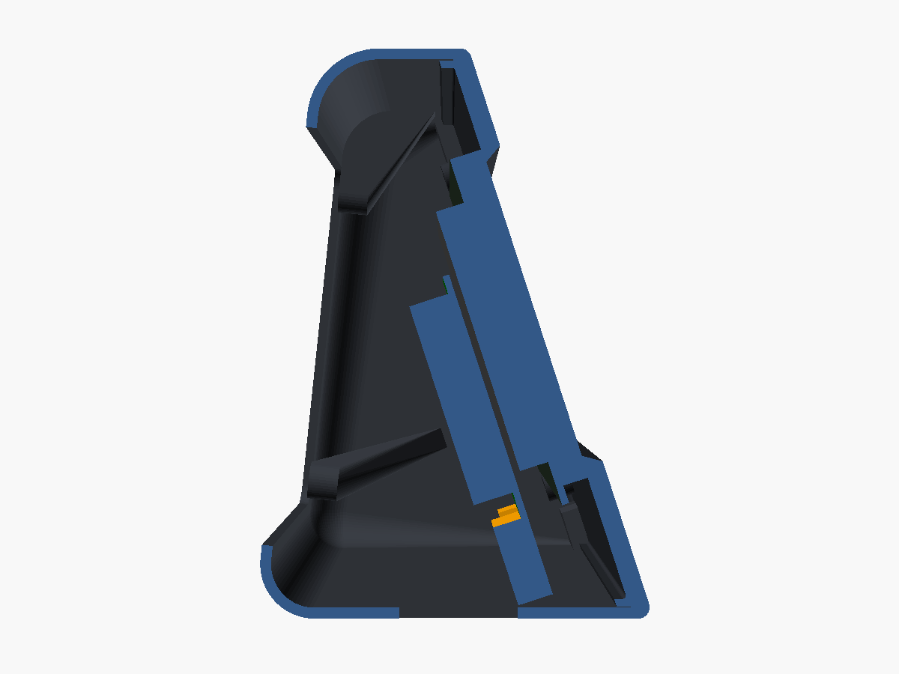

# Echo Show–style desk enclosure (5" Elecrow DIS05490T + Pi 3)

A wedge-shaped desk stand for the kiosk. It has a tilted screen, wide bezels
and room inside for the cables. **Every cable leaves through one notch in the
back panel.** The front bezel is held on by hidden magnets, so there are no
screws on the front.

| Front | Back |
|---|---|
|  |  |

Outside size: **178 × 126 × 88 mm** (W × H × D). The screen tilts back 18°.

*Cutaway through the middle. On the right, the display and Pi (ghosted) are
screwed to the bezel. The body behind them leaves room to bend cables down to
the back notch.*

## ⚠️ Measure before you print

This model is based on the display's published outline (137 × 80 mm) and
photos, not caliper measurements. Check these values in
[`ha-panel-5in.scad`](ha-panel-5in.scad) (the "Display" section) and adjust
them if they differ:

| Setting | What to measure | Default |
|---|---|---|
| `board_w`, `board_h` | Display circuit board outline | 137 × 80 |
| `active_w`, `active_h` | The lit picture area (turn the screen on and measure the edges of the image) | 108 × 64.8 |
| `active_off_x`, `active_off_y` | How far the centre of the picture is from the centre of the board (+ = right / up, looking at the screen) | −2, +3 |
| `pcb_back_depth` | From the front of the glass to the **back** of the circuit board, at a corner | 7.5 |

**Print the bezel first.** It's the part the display screws onto, so it also
works as a fit test. Once the display sits right in it, print the rest.

Open the `.scad` file in [OpenSCAD](https://openscad.org) (free), change the
numbers, then choose *Render* (F6) and *Export STL*. Set `part` to the part you
want to export.

## Parts

Ready-made STLs are in [`stl/`](stl). They're already oriented for printing:

| File | Qty | How to print | Supports |
|---|---|---|---|
| `bezel.stl` | 1 | Front face down | None |
| `body.stl` | 1 | Open front down on the bed | Optional: *tree supports, build plate only*. These help the underside of the back rim; it's hidden inside either way. |
| `back_plate.stl` | 1 | Flat | None |
| `clamp.stl` | 4 | Flat | None |

PLA or PETG, 0.2 mm layers, 3 walls, 15–20% infill. All parts fit on a
220 × 220 mm bed. Print the bezel and the back plate in the same colour as the
body, or in a contrasting one.

## What to buy

- **8× neodymium disc magnets, 8 × 2 mm.** Glue them in with super glue.
- **8× M3 × 8 mm screws**: 4 countersunk (back plate) and 4 pan-head (display
  clamps). They self-tap into the printed holes.
- **Right-angle cable adapters.** Straight plugs won't fit inside:
  - a **short, thin HDMI cable (15–20 cm)** or an HDMI ribbon kit, with a
    **90° HDMI adapter** on the Pi end, to replace the long loop
  - a **90° micro-USB power cable** for the Pi (a good 2.5 A supply)
  - a **short USB-A to 90° USB-C cable** for the display's touch/power port
- Optional: 4 stick-on rubber feet, 10–12 mm. The bottom has shallow recesses
  for them.

Use **Wi-Fi rather than Ethernet**. There isn't room beside the Pi for an
Ethernet plug.

## Assembly

1. **Magnets.** Glue 4 magnets into the pockets on the back of the bezel and 4
   into the matching pockets at the front corners of the body. **Check the
   polarity first:** each bezel magnet has to *attract* the body magnet it
   meets. Stick each pair together, mark the facing sides, then glue.
2. **Display.** Lay the display face-down into the bezel. The L-shaped corner
   guides line it up with the window. Screw a clamp onto each of the 4 posts,
   with the tab over the edge of the board.
3. **Cables.** Connect Pi HDMI → display HDMI and Pi USB → display USB-C. Plug
   the power cable into the Pi. Tuck the slack into the space below the Pi.
4. **Close it up.** Pass the power cable out through the back opening, press
   the bezel onto the body (the magnets pull it in), then lay the cable into
   the notch and screw on the back plate.

To open it again, pry gently at the bottom edge of the bezel.

## Customising

Everything is a parameter at the top of the `.scad` file: `tilt`, `width`,
`face_height`, bezel thickness, `top_depth` and `base_depth` (the wedge shape),
and the corner radii. Set `part = "preview"` to see the assembly with the ghost
display and Pi, and check nothing collides after a change.
